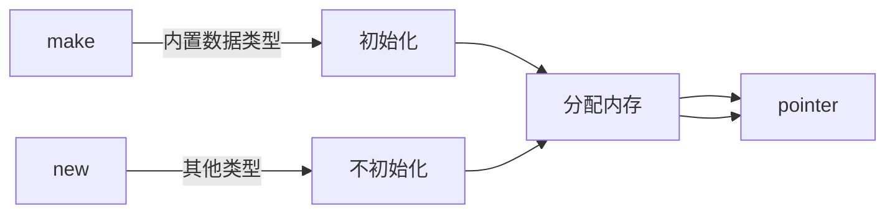
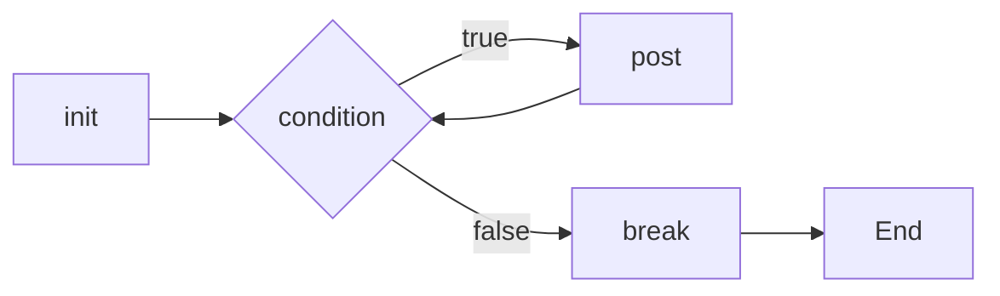

# base

本小节来学习基本语法。

## 注释

Go 的注释使用 `//` 或者 `/**/` 来声明，与大多数语言一致，变量内的内容不会被编译。同时 Go 的注释还能起到类似于注解的作用(?)

## 变量

Go 的变量有两种声明方式，比如使用 `var` 关键词：

```go
var var type
```

还可以同时声明多个相同类型的变量：

```go
var var1, var2 type
```

这就类似于某些语言的：

```java
Type var1 var2;
```

还可以使用海象运算符[<sup>1</sup>](#refer)来声明：

```go
var := value
```

但是注意在使用海象运算符的时候，必须有至少一个新的变量被声明，不然编译器会报错 `no new variables on left side of :=`，错误示范见 [bad.go](bad.go)。

## 函数声明

Go 的函数声明使用 `func` 关键词：

```go
func func_name(parammeter type) return_type {
    // func body
}
```

## defer 关键词

使用 `defer` 关键词的表达式会在函数返回之前进行调用。

## OOP

### 结构体

Go 的结构体定义如下：

```go
type struct_name struct {
    name type
}
```

结构体可以被初始化：

```go
type Shit struct {
    Color string
    Taste string
}
```

结构体可以有他的方法，是这么定义的：

```go
func (recv type) methodName(parameter_list) (return_value_list) { … }
```

一个完整的例子：

```go
type Shit struct {
 Color string
 Taste string
}

func (s Shit) eat() string {
 return fmt.Sprintf("You ate a %s shit! It smells like %s", s.Color, s.Taste)
}

func main() {
 fmt.Println(Shit{Color: "green", Taste: "rotten eggs"}.eat())
}
```

我们还可以利用指针，声明出类似于其他语言的 OOP 中的*静态函数*。

```go
func (s *Shit) init() *Shit {
 return &Shit{Color: "green", Taste: "rotten eggs"}
}
```

### 接口

Go 的接口与结构体相似（？），但是里面的 member 是函数，声明如下：

```go
type interface_name interface {
  method_name() result
}
```

Go 还有一种东西叫做空接口，可以直接用 `interface{}` 声明，空接口类似于 Kotlin 中的 `Any?` 类型，可以承载任何类型。

## new 和 make

`new` 和 `make` 关键词都用于分配一片内存空间，如下图：



这里注意，`new` 出来的 `struct` 里的 member 都是空值：

```go
shit := new(Shit)

fmt.Printf("%T\n", shit.Color)
fmt.Println(shit.Color)
```

输出结果为：

```
string

```

不难看出，`shit.Color` 为空值。

## For 循环

Go 中的 `for` 语句有多种，基本格式与 C 的 `for` 基本一致：

```go
for init; condition; post { }
```

不过，`init`, `condition`, `post` 都是可以省略的。

如下图所示：



首先第一种是无条件的无限循环：

```go
for {
    fmt.Println("根本停不下来！")
}
```

然后是只有一个条件的循环：

```go
var i int
for i <= 3 {
    i += 1
    fmt.Println(i)
}
```

等价于：

```go
for i := 0; i <= 3; i++ {
    fmt.Println(i)
}
```

## 条件语句

条件语句总体上跟 C 差不多，但是注意在 Go 中一般 `if` 语句不写括号。

在 Switch 语句中，如果匹配的是类型，那么在匹配到相应的类型后，会自动转换到被 `case` 到的类型，类似于 Kotlin 语言 `when` 语句中的智能转换。

如果你想了解更多，参考 [这篇文章](https://gobyexample-cn.github.io/switch) 和 [这篇文章](https://gobyexample-cn.github.io/if-else)。

## 闭包

~~听起来很高级，其实就是匿名函数呢~~

Go 的函数类型非常简单，比如一个返回 int 的函数，他的类型就是 `func() int`，依次类推，我们可以写出下面的代码：

```go
func test(nmsl int) func(int) int {
	return func(nmsl int) int {
		return nmsl
	}
}
```

`test` 函数返回了一个参数为 int，返回值为 int 的匿名函数。

## 递归[<sup>2</sup>](#refer)

> 要理解递归，就得先理解什么是递归。

递归的基本思想是某个函数直接或者间接地调用自身。

以下是一些有助于理解递归的例子：

什么是递归？
如何给一堆数字排序？答：分成两半，先排左半边再排右半边，最后合并就行了，至于怎么排左边和右边，请重新阅读这句话。

你今年几岁？答：去年的岁数加一岁，1999 年我出生。

用代码表示就是这样：

```go
func nmsl() {
    nmsl()
}
```

总结成一句话，自己调用自己即是递归。

## 引用/声明

<div id="refer" />

[1] 海象运算符原版是 Python 里对 `:=` 符号的描述，这里借用来描述 `:=` 符号。

[2] 定义和引入部分引用自 [OI-wiki](https://github.com/OI-wiki/OI-wiki) 的 [递归 & 分治 一章](https://oi-wiki.org/basic/divide-and-conquer/#%E9%80%92%E5%BD%92)。